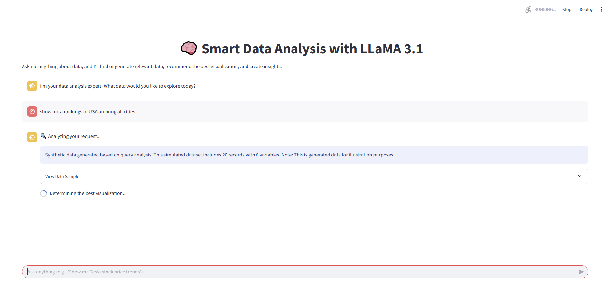

# Smart Data Analysis with LLaMA 3.1


## Overview

This application uses LLaMA 3.1 to analyze data queries, generate or retrieve relevant datasets, recommend appropriate visualizations, and provide insights. It's designed to make data analysis accessible through natural language queries.



## Features

- 🔍 **Natural Language Data Queries**: Ask anything about data in plain English
- 📊 **Intelligent Visualization Selection**: Automatically selects the best visualization for your data
- 🧠 **LLaMA 3.1 Powered Analysis**: Leverages the LLaMA 3.1 large language model for insightful analysis
- 🔄 **Synthetic Data Generation**: Creates realistic data when actual data isn't available
- 📈 **Interactive Visualizations**: Displays results with customized charts and graphs

## Installation

1. Clone this repository:
```bash
git clone https://github.com/yourusername/smart-data-analysis.git
cd smart-data-analysis
```

2. Install the required dependencies:
```bash
pip install -r requirements.txt
```

3. Set up your LLaMA API key in `config/settings.py` or through environment variables.

## Usage

1. Start the Streamlit application:
```bash
streamlit run app.py
```

2. Open your browser and navigate to the URL displayed in the terminal (typically http://localhost:8501)

3. Type your data query in the chat input, for example:
   - "Show me Tesla stock price trends"
   - "Compare monthly sales for different product categories"
   - "Analyze population growth in major cities over the last decade"

## Project Structure

```
smart-data-analysis/
├── app.py                  # Main Streamlit application
├── requirements.txt        # Project dependencies
├── utils/
│   ├── api.py              # API communication functions
│   └── data_utils.py       # Data handling utilities
├── modules/
│   ├── data_retrieval.py   # Data acquisition functions
│   ├── visualization.py    # Visualization functions
│   └── analysis.py         # Data analysis functions
└── config/
    └── settings.py         # Configuration settings
```

## Configuration

You can configure the application by editing the `config/settings.py` file:

- Set your LLaMA API key
- Adjust visualization parameters
- Configure data source preferences

## License

[MIT License](LICENSE)

## Acknowledgements

- This project uses the LLaMA 3.1 API provided by LLM API
- Built with Streamlit for interactive web applications
- Uses Matplotlib and Pandas for data visualization and manipulation